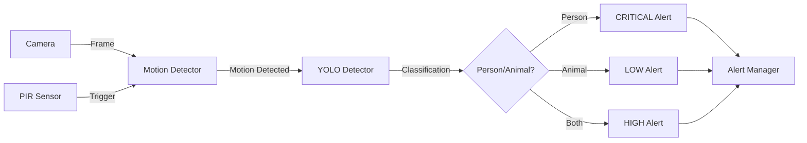
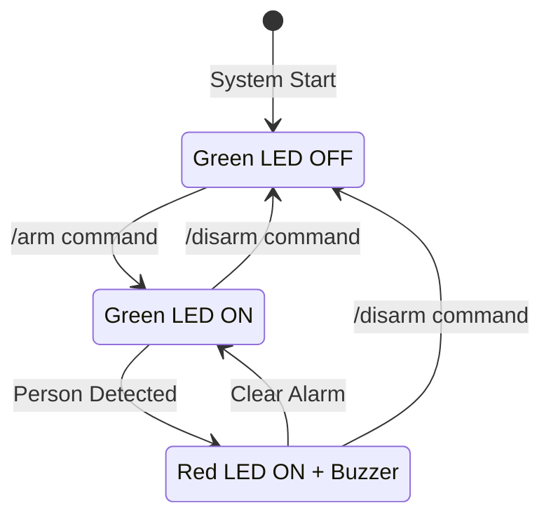

# System Architecture

## Overview

Smart Security System uses a modular, multi-threaded architecture running on Raspberry Pi 4.

---

## High-Level Architecture

```
┌──────────────────────────────────────────────────────────────────┐
│                         USER INTERFACES                           │
│                                                                    │
│   ┌─────────────────────┐         ┌─────────────────────┐       │
│   │   Web Dashboard     │         │   Telegram Bot      │       │
│   │   (Flask + MJPEG)   │         │   (Commands/Alerts)  │       │
│   └──────────┬──────────┘         └──────────┬──────────┘       │
└──────────────┼─────────────────────────────────┼──────────────────┘
               │                                  │
┌──────────────▼──────────────────────────────────▼──────────────────┐
│                      SYSTEM MANAGER                                 │
│                   (Main Orchestrator)                               │
│                                                                     │
│  ┌─────────────┐  ┌──────────────┐  ┌─────────────┐  ┌──────────┐│
│  │  Hardware   │  │  Detection   │  │   Alerts    │  │Streaming ││
│  │  Manager    │  │   Pipeline   │  │   Manager   │  │  Engine  ││
│  └──────┬──────┘  └──────┬───────┘  └──────┬──────┘  └────┬─────┘│
└─────────┼─────────────────┼──────────────────┼──────────────┼──────┘
          │                 │                  │              │
┌─────────▼─────────────────▼──────────────────▼──────────────▼──────┐
│                        HARDWARE LAYER                                │
│                                                                      │
│   ┌────────┐  ┌──────┐  ┌─────┐  ┌────────┐  ┌────────────────┐  │
│   │ Camera │  │ PIR  │  │ LEDs│  │ Buzzer │  │  Raspberry Pi  │  │
│   │  USB   │  │Sensor│  │     │  │        │  │    GPIO        │  │
│   └────────┘  └──────┘  └─────┘  └────────┘  └────────────────┘  │
└──────────────────────────────────────────────────────────────────────┘
```

---

## Component Architecture

### 1. Hardware Layer

**Components:**
- **Camera (USB Webcam)**: Continuous frame capture (640x480 @ 15 FPS)
- **PIR Sensor (HC-SR501)**: Infrared motion detection trigger
- **LEDs (Green/Red)**: Visual status indicators
- **Buzzer (Active 5V)**: Audio alarm
- **Raspberry Pi 4 GPIO**: Interface for all components

### 2. Detection Pipeline



**Flow:**
1. PIR sensor triggers on heat signature
2. Motion detector confirms with OpenCV (reduce false positives)
3. YOLO classifies: Person (class 0) vs Animal (classes 15-23)
4. Alert prioritized and queued

### 3. Threading Model

```
Main Thread
├── Camera Thread (Continuous)
│   └── Frame capture → Queue
│
├── Detection Thread (Conditional)
│   ├── PIR monitoring
│   ├── Motion detection (OpenCV)
│   └── YOLO inference
│
├── Alert Thread (Queue-based)
│   ├── Priority queue processing
│   └── Cooldown management
│
├── Telegram Thread (Polling)
│   ├── Command handling
│   └── Message sending
│
└── Flask Thread (Web Server)
    ├── Dashboard serving
    └── MJPEG streaming
```

**Inter-thread Communication:**
- Thread-safe Queues for frame sharing
- Threading Events for synchronization
- Locks for shared state access

### 4. State Machine



---

## Data Flow

### Detection Flow

```
1. PIR Trigger
   ├─> GPIO Interrupt
   └─> Set motion flag

2. Motion Detection
   ├─> Get frame from camera
   ├─> Background subtraction (MOG2)
   ├─> Contour detection
   └─> Filter by minimum area

3. YOLO Classification
   ├─> Resize frame (416x416)
   ├─> Model inference
   ├─> Parse detections
   └─> Classify (person/animal)

4. Alert Generation
   ├─> Determine priority
   ├─> Queue alert
   └─> Apply cooldown

5. Notification
   ├─> Telegram message
   ├─> Attach photo
   └─> Update dashboard
```

### Alert Priority System

| Detection | Alert Level | Priority | Action |
|-----------|-------------|----------|--------|
| Person only | CRITICAL | 3 | Immediate alert + alarm |
| Person + Animal | HIGH | 2 | Quick alert |
| Animal only | LOW | 1 | Delayed alert |
| None | NONE | 0 | No alert |

---

## Module Dependencies

```
main.py
└── SystemManager (core)
    ├── Hardware
    │   ├── Camera
    │   ├── PIRSensor
    │   ├── LEDController
    │   └── Buzzer
    ├── Detection
    │   ├── MotionDetector
    │   └── YOLODetector
    ├── Alerts
    │   ├── TelegramBot
    │   └── AlertManager
    └── Streaming
        ├── FlaskServer
        └── VideoStreamer
```

---

## Configuration Flow

```
.env file
    ↓
Settings (config/settings.py)
    ↓
System Manager
    ↓
Components initialization
```

---

## Performance Considerations

### Bottlenecks

1. **YOLO Inference**: Slowest component (~200-300ms)
   - **Solution**: Skip frames (process 1 out of 3)
   - **Solution**: Run only when motion detected

2. **Camera FPS**: Limited to 15 FPS
   - **Solution**: Async capture in separate thread
   - **Solution**: Queue only latest frames

3. **GPIO Interrupts**: Can miss rapid events
   - **Solution**: Dual detection (PIR + OpenCV)

### Optimizations

- **Threading**: Parallel processing of capture, detection, alerts
- **Frame skipping**: YOLO processes subset of frames
- **Cooldown**: Prevent alert spam (30s default)
- **Queue limits**: Keep only latest frames (maxsize=2)

---

## Failure Handling

### Component Failures

| Component | Failure Mode | Handling |
|-----------|--------------|----------|
| Camera | Not found/disconnected | Log error, attempt reconnect |
| PIR Sensor | GPIO error | Fall back to OpenCV-only |
| YOLO Model | Load failure | Disable AI, use motion only |
| Telegram Bot | Network error | Queue alerts, retry |
| Flask Server | Port in use | Log error, try alternate port |

### Graceful Shutdown

1. Stop detection thread
2. Stop alert processing
3. Stop web server
4. Release camera
5. Cleanup GPIO
6. Log statistics

---

## Security Considerations

- **Local Processing**: No data sent to cloud
- **Telegram Encryption**: End-to-end encrypted
- **Web Access**: Local network only (no port forwarding by default)
- **GPIO Permissions**: Restricted to specific user groups

---

**Last Updated:** 2024-10-27
